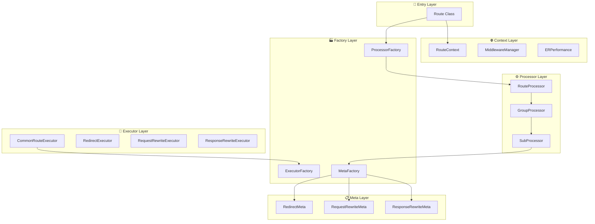

<div align="center">
<h1>🍥 Unieo</h1>
🐚 A schema-driven routing engine for edge computing environments.
</div>
<br>

Unieo `[/juːniˈoʊ/]` brings code-free routing management to edge computing, with built-in **[WinterTC standards](https://wintertc.org/)** compliance for seamless deployment across Cloudflare Workers, Vercel Edge Functions, Aliyun EdgeRoutine, and other modern edge runtimes.

## 💡 Motivation

### 🌐 Understanding Edge Computing

Edge computing runs your code at data centers closest to your users, rather than in a single centralized location. This distributed approach delivers faster response times and better user experiences globally.

The Benefits:
- 🚀 Lower Latency - Users connect to nearby servers instead of distant ones
- 🌍 Global Scale - Deploy once and run everywhere automatically
- 💪 Improved Performance - Faster page loads and better user experience

Popular edge platforms include Cloudflare Workers, Vercel Edge Functions, and Aliyun EdgeRoutine.

### 🎯 The Routing Challenge

Edge computing unlocks performance benefits, but introduces complexity in managing routing logic across distributed environments.

**Common Requirements:**
- 🌍 Serve localized content based on user geography
- 📱 Provide optimized experiences for different device types
- 👑 Route premium users to enhanced features
- 🧪 Implement A/B testing and feature flags

**The Traditional Problem:** Every routing change requires code modifications and redeployment across all edge locations.

### 💡 How Unieo Solves This

Unieo separates routing logic from application code through declarative configuration. Update routing rules instantly without touching your codebase.

**The Unieo Approach:**
```typescript
// Route users by geography
{
  name: 'geo-routing',
  processor: 'COMMON_SUB_PROCESSOR',
  meta: {
    match: {
      list: [{
        origin: { source: 'cf-ipcountry', sourceType: 'request_header' },
        criteria: { source: 'CN', sourceType: 'literal' },
        operator: 'equal'
      }]
    },
    requestRewrites: [{
      type: 'url',
      value: { source: '/zh/home', sourceType: 'literal' },
      operation: 'set'
    }]
  }
}
```

**Key Benefits:**
- 🚀 **Instant Updates** - Change routing rules without code deployment
- 🌐 **WinterTC Compliance** - Built on web standards for universal compatibility
- 🎯 **Smart Routing** - Route based on location, device, headers, or custom criteria
- 🔧 **Schema-Driven** - Define complex logic through declarative configuration
- ⚡ **Edge-Optimized** - Minimal overhead for maximum performance

This approach enables dynamic routing rule distribution across edge environments while seamlessly integrating with existing development and configuration platforms.

## 📥 Installation

```bash
npm install @unieojs/unieo --save
```

## 🏃‍♂️ Quick Start

> [!WARNING]
> 🚧 **Development Notice**: Unieo is currently under active development, we are developing a more concise and intuitive routing API. Stay tuned! You'll be able to achieve the same functionality with much less code in the future.

### 💡 Basic Usage

This example demonstrates a health check route that matches when the request URL path equals `/health` and rewrites the response header `content-type` to `application/json`:

- **Match condition**: `origin.source: 'path'` extracts the URL path, `criteria.source: '/health'` defines the target value, `operator: 'equal'` performs exact matching
- **Response rewrite**: Sets the `content-type` header to `application/json` when the route matches

```typescript
import { Route } from 'unieo';

addEventListener('fetch', (event: FetchEvent) => {
  // Create Route instance
  const route = new Route({ event });
  
  // Define routes configuration
  const routes = [
    {
      name: 'api-routes',
      type: 'api',
      processor: 'COMMON_GROUP_PROCESSOR',
      routes: [
        {
          name: 'health-check',
          type: 'health',
          processor: 'COMMON_SUB_PROCESSOR',
          meta: {
            match: {
              list: [
                {
                  origin: { source: 'path', sourceType: 'url' },
                  criteria: { source: '/health', sourceType: 'literal' },
                  operator: 'equal'
                }
              ]
            },
            responseRewrites: [
              {
                type: 'header',
                field: 'content-type',
                value: { source: 'application/json', sourceType: 'literal' },
                operation: 'set'
              }
            ]
          }
        }
      ]
    }
  ];
  
  // Execute routes
  const response = route.execute(routes);
  
  // Respond
  event.respondWith(response);
});
```

## 🎨 Real-World Examples

> [!NOTE]
> **Event Type Notice**: While the examples use `FetchEvent` for compatibility, Unieo internally expects `ERFetchEvent` which extends `FetchEvent` with additional edge computing context. In practice, you can use standard `FetchEvent` and it will work correctly. The `ERInfo` interface provides edge computing specific information and will be populated by your edge runtime environment.

### 🌐 API Gateway

Perfect for building API gateways that need request routing, authentication, and response transformation:

- **Match logic**: Uses `operator: 'regexp'` to match paths starting with `/api/private` using the pattern `^/api/private`
- **Request rewrite**: Adds `x-auth-required: true` header to mark the request as requiring authentication

```typescript
const apiGatewayRoutes = [
  {
    name: 'auth-group',
    type: 'authentication',
    processor: 'COMMON_GROUP_PROCESSOR',
    routes: [
      {
        name: 'require-auth',
        type: 'auth-check',
        processor: 'COMMON_SUB_PROCESSOR',
        meta: {
          match: {
            list: [
              {
                origin: { source: 'path', sourceType: 'url' },
                criteria: { source: '^/api/private', sourceType: 'literal' },
                operator: 'regexp'
              }
            ]
          },
          requestRewrites: [
            {
              type: 'header',
              field: 'x-auth-required',
              value: { source: 'true', sourceType: 'literal' },
              operation: 'set'
            }
          ]
        }
      }
    ]
  }
];
```

### 🚀 CDN Edge Logic

Implement sophisticated CDN logic with cache control and content optimization:

- **Match logic**: Uses `operator: 'regexp'` with pattern `\\.(jpg|jpeg|png|webp)$` to match image file extensions
- **Middleware chain**: Applies `ImageOptimization` middleware with quality settings, followed by `DefaultFetch`

```typescript
const cdnRoutes = [
  {
    name: 'static-assets',
    type: 'cdn',
    processor: 'COMMON_GROUP_PROCESSOR',
    routes: [
      {
        name: 'image-optimization',
        type: 'image',
        processor: 'COMMON_SUB_PROCESSOR',
        meta: {
          match: {
            list: [
              {
                origin: { source: 'path', sourceType: 'url' },
                criteria: { source: '\\.(jpg|jpeg|png|webp)$', sourceType: 'literal' },
                operator: 'regexp'
              }
            ]
          },
          requestRewrites: [
            {
              type: 'middleware',
              value: {
                source: [
                  ['ImageOptimization', { quality: 80, format: 'webp' }],
                  ['DefaultFetch', {}]
                ],
                sourceType: 'literal'
              },
              operation: 'set'
            }
          ]
        }
      }
    ]
  }
];
```

### 🧪 A/B Testing

Implement dynamic A/B testing based on user characteristics:

- **Match logic**: Combines two conditions with `operator: 'and'`:
  - Checks `x-user-segment` header equals `beta` 
  - Checks URL path starts with `/app` using `operator: 'prefix'`
- **URL rewrite**: Redirects matching requests to `/app-beta` path

```typescript
const abTestingRoutes = [
  {
    name: 'feature-toggle',
    type: 'ab-test',
    processor: 'COMMON_GROUP_PROCESSOR',
    routes: [
      {
        name: 'new-ui-test',
        type: 'ui-variant',
        processor: 'COMMON_SUB_PROCESSOR',
        meta: {
          match: {
            list: [
              {
                origin: { source: 'x-user-segment', sourceType: 'request_header' },
                criteria: { source: 'beta', sourceType: 'literal' },
                operator: 'equal'
              },
              {
                origin: { source: 'path', sourceType: 'url' },
                criteria: { source: '/app', sourceType: 'literal' },
                operator: 'prefix'
              }
            ],
            operator: 'and'
          },
          requestRewrites: [
            {
              type: 'url',
              value: { source: '/app-beta', sourceType: 'literal' },
              operation: 'set'
            }
          ]
        }
      }
    ]
  }
];
```

### 📱 Device-Based Routing

Route requests based on device characteristics for optimal user experience:

- **Match logic**: Uses `sourceType: 'request_header'` with `source: 'user-agent'` to detect device type through User-Agent header analysis
- **Request rewrite**: Adds `x-mobile-optimized: true` header for mobile-specific processing

> [!TIP]
> **Device Detection**: This example demonstrates User-Agent based device detection using regex patterns. For more sophisticated device detection, consider integrating specialized device detection libraries in your custom middleware.

```typescript
const deviceRoutes = [
  {
    name: 'device-routing',
    type: 'responsive',
    processor: 'COMMON_GROUP_PROCESSOR',
    routes: [
      {
        name: 'mobile-optimization',
        type: 'mobile',
        processor: 'COMMON_SUB_PROCESSOR',
        meta: {
          match: {
            list: [
              {
                origin: { source: 'user-agent', sourceType: 'request_header' },
                criteria: { source: 'Mobile|Android|iPhone', sourceType: 'literal' },
                operator: 'regexp'
              }
            ]
          },
          requestRewrites: [
            {
              type: 'header',
              field: 'x-mobile-optimized',
              value: { source: 'true', sourceType: 'literal' },
              operation: 'set'
            }
          ]
        }
      }
    ]
  }
];
```

### 🌍 Geo-based Routing

Serve localized content based on user location:

- **Match logic**: Uses `sourceType: 'request_header'` with `source: 'cf-ipcountry'` to get user's country from Cloudflare's geolocation header
- **Response rewrite**: Sets `x-privacy-policy: gdpr-compliant` header for EU users

> [!TIP]
> **Geolocation Headers**: This example uses Cloudflare's `cf-ipcountry` header. Different edge platforms provide different geolocation headers (e.g., Vercel uses `x-vercel-ip-country`, AWS CloudFront uses `cloudfront-viewer-country`). Adapt the header name based on your edge platform.

```typescript
const geoRoutes = [
  {
    name: 'geo-routing',
    type: 'localization',
    processor: 'COMMON_GROUP_PROCESSOR',
    routes: [
      {
        name: 'eu-compliance',
        type: 'gdpr',
        processor: 'COMMON_SUB_PROCESSOR',
        meta: {
          match: {
            list: [
                              {
                  origin: { source: 'cf-ipcountry', sourceType: 'request_header' },
                  criteria: { source: '^(FR|DE|IT|ES|NL|BE|AT|PT|IE|LU|FI|SE|DK|EE|LV|LT|PL|CZ|SK|HU|SI|HR|BG|RO|MT|CY)$', sourceType: 'literal' },
                  operator: 'regexp'
                }
            ]
          },
          responseRewrites: [
            {
              type: 'header',
              field: 'x-privacy-policy',
              value: { source: 'gdpr-compliant', sourceType: 'literal' },
              operation: 'set'
            }
          ]
        }
      }
    ]
  }
];
```

## ⚙️ Advanced Configuration

### 🔗 Middleware Integration

Unieo supports a comprehensive middleware system with custom middleware registration:

#### 📝 Creating Custom Middleware

First, create your custom middleware following the `MiddlewareGen` pattern:

```typescript
import type { MiddlewareGen, BaseMiddlewareOption, RouteContext, MiddlewareNext } from 'unieo';

// Define your middleware options interface
interface AuthMiddlewareOption extends BaseMiddlewareOption {
  secret: string;
  headerName?: string;
}

// Create the middleware generator
const AuthMiddleware: MiddlewareGen<AuthMiddlewareOption> = (opt) => {
  return async (ctx: RouteContext, next: MiddlewareNext) => {
    const { secret, headerName = 'authorization' } = opt;
    
    // Get auth header from request
    const authHeader = ctx.request.headers.get(headerName);
    
    if (!authHeader || !authHeader.includes(secret)) {
      // Set unauthorized response
      const response = new Response('Unauthorized', {
        status: 401,
        headers: { 'content-type': 'text/plain' }
      });
      ctx.setResponse(response);
      return; // Don't call next() to short-circuit the middleware chain
    }
    
    // Add custom header to indicate auth success
    ctx.request = new Request(ctx.request, {
      headers: {
        ...Object.fromEntries(ctx.request.headers),
        'x-auth-verified': 'true'
      }
    });
    
    await next(); // Continue to next middleware
  };
};

// Rate limiting middleware example
interface RateLimitMiddlewareOption extends BaseMiddlewareOption {
  limit: number;
  window: number; // in milliseconds
}

const RateLimitMiddleware: MiddlewareGen<RateLimitMiddlewareOption> = (opt) => {
  const requestCounts = new Map<string, { count: number; resetTime: number }>();
  
  return async (ctx: RouteContext, next: MiddlewareNext) => {
    const { limit, window } = opt;
    const clientIP = ctx.request.headers.get('cf-connecting-ip') || 'unknown';
    const now = Date.now();
    
    // Get or initialize request count for this IP
    let clientData = requestCounts.get(clientIP);
    if (!clientData || now > clientData.resetTime) {
      clientData = { count: 0, resetTime: now + window };
      requestCounts.set(clientIP, clientData);
    }
    
    clientData.count++;
    
    if (clientData.count > limit) {
      const response = new Response('Rate limit exceeded', {
        status: 429,
        headers: {
          'content-type': 'text/plain',
          'retry-after': Math.ceil((clientData.resetTime - now) / 1000).toString()
        }
      });
      ctx.setResponse(response);
      return;
    }
    
    await next();
  };
};
```

#### 🔧 Registering Custom Middleware

Register your custom middleware when creating the Route instance:

```typescript
import { Route } from 'unieo';

const route = new Route({
  event,
  logger: console, // Custom logger
  httpClient: {    // Custom HTTP client
    request: async (request, options) => {
      // Custom fetch logic
      return fetch(request, options);
    }
  },
  // Register custom middleware
  middlewares: [
    ['Auth', AuthMiddleware],
    ['RateLimit', RateLimitMiddleware],
    // Add more custom middleware here
  ]
});
```

#### 📋 Using Custom Middleware in Routes

Now you can use your custom middleware in route configurations:

```typescript
// Routes with custom middleware configuration
const routesWithMiddleware = [
  {
    name: 'api-with-middleware',
    type: 'api',
    processor: 'COMMON_GROUP_PROCESSOR',
    routes: [
      {
        name: 'protected-endpoint',
        type: 'protected',
        processor: 'COMMON_SUB_PROCESSOR',
        meta: {
          requestRewrites: [
            {
              type: 'middleware',
              value: {
                source: [
                  ['Auth', { secret: 'your-secret-key', headerName: 'x-api-key' }],
                  ['RateLimit', { limit: 100, window: 60000 }], // 100 requests per minute
                  ['DefaultFetch', {}] // Always include DefaultFetch as the last middleware
                ],
                sourceType: 'literal'
              },
              operation: 'set'
            }
          ]
        }
      }
    ]
  }
];
```

### 🧠 Complex Matching Logic

Unieo's Match system supports sophisticated conditional logic through its Value system:

```typescript
const complexRoutes = [
  {
    name: 'complex-matching',
    type: 'advanced',
    processor: 'COMMON_GROUP_PROCESSOR',
    routes: [
      {
        name: 'multi-condition-route',
        type: 'conditional',
        processor: 'COMMON_SUB_PROCESSOR',
        meta: {
          match: {
            list: [
              {
                // Match specific user agent using regex
                origin: { source: 'user-agent', sourceType: 'request_header' },
                criteria: { source: 'bot|crawler', sourceType: 'literal' },
                operator: 'regexp'
              },
              {
                // Match time range (requires middleware to set header)
                origin: { source: 'x-current-hour', sourceType: 'request_header' },
                criteria: { source: '9', sourceType: 'literal' },
                operator: 'gte'
              },
              {
                // Match API paths using prefix matching
                origin: { source: 'path', sourceType: 'url' },
                criteria: { source: '/api/', sourceType: 'literal' },
                operator: 'prefix'
              },
              {
                // Advanced: Nested value processing
                origin: {
                  source: {
                    userType: { source: 'x-user-type', sourceType: 'request_header' },
                    region: { source: 'cf-ipcountry', sourceType: 'request_header' }
                  },
                  sourceType: 'value_object'
                },
                criteria: {
                  source: { userType: 'premium', region: 'US' },
                  sourceType: 'literal'
                },
                operator: 'equal'
              }
            ],
            operator: 'and' // All conditions must match
          },
          // Apply custom processing when matched
          requestRewrites: [
            {
              type: 'header',
              field: 'x-route-matched',
              value: { source: 'complex-route', sourceType: 'literal' },
              operation: 'set'
            }
          ]
        }
      }
    ]
  }
];
```

#### 🎯 Match System Features

- **Nested Logic**: Support for complex AND/OR operations
- **Value Integration**: Dynamic value extraction and comparison
- **Operator Variety**: Equal, regex, prefix, range, and custom operators
- **Type Coercion**: Automatic type conversion for comparisons

## 📖 Route Configuration Reference

### 📂 GroupRouteConfig

```typescript
interface GroupRouteConfig {
  name: string;                    // Unique identifier for the route group
  type: string;                    // Route type for categorization
  processor: GroupProcessorType;   // Processor type to handle the group
  routes: SubRouteConfig[];        // Array of sub-routes
  status?: RouteStatus;            // ONLINE | OFFLINE
  meta?: object;                   // Additional metadata
  args?: Record<string, unknown>;  // Processor arguments
}
```

### 📄 SubRouteConfig

```typescript
interface SubRouteConfig {
  name: string;                  // Unique identifier for the sub-route
  type: string;                  // Route type for categorization
  processor: SubProcessorType;   // Processor type to handle the route
  status?: RouteStatus;          // ONLINE | OFFLINE
  meta?: {
    match?: MatchConfig;         // Matching conditions
    redirects?: RedirectConfig[];     // Redirect rules
    requestRewrites?: RequestRewriteConfig[];   // Request modifications
    responseRewrites?: ResponseRewriteConfig[]; // Response modifications
    [key: string]: unknown;      // Custom meta types via MetaFactory
  };
  args?: Record<string, unknown>; // Processor arguments
}
```

### 📋 Meta Layer Architecture

The Meta layer is the heart of Unieo's processing system, utilizing the Factory pattern for dynamic behavior:

#### 🏭 MetaFactory System

```typescript
// Meta types are registered with MetaFactory
enum MetaType {
  REDIRECT = 'redirects',
  REQUEST_REWRITE = 'requestRewrites', 
  RESPONSE_REWRITE = 'responseRewrites'
}

// Each meta type has corresponding data structure
interface SubRouteMetaTypes {
  redirects?: RawRedirect[];           // Handled by RedirectMeta
  requestRewrites?: RawRequestRewrite[]; // Handled by RequestRewriteMeta
  responseRewrites?: RawResponseRewrite[]; // Handled by ResponseRewriteMeta
}
```

#### 🔄 Meta Processing Flow

1. **Configuration Parsing**: SubProcessor reads meta configuration
2. **Factory Creation**: MetaFactory creates appropriate Meta instances based on type
3. **Processing**: Each Meta instance handles its specific logic (redirects, rewrites, etc.)
4. **Execution**: Executors coordinate Meta processing through the pipeline

#### 🎯 Built-in Meta Types

- **RedirectMeta**: Handles URL redirections with pattern matching
- **RequestRewriteMeta**: Modifies incoming requests (headers, URL, middleware)
- **ResponseRewriteMeta**: Transforms outgoing responses (headers, content)

#### 💎 Value System Integration

Meta processing leverages Unieo's powerful Value system for dynamic data extraction and transformation:

```typescript
// Value configuration structure
interface ValueRawData {
  source: unknown;           // The data source (header name, URL part, etc.)
  sourceType: string;        // How to extract the data
  valueType?: ValueType;     // How to process the extracted data
}

// Available source types
enum ValueSourceType {
  LITERAL = 'literal',                    // Static value
  REQUEST_HEADER = 'request_header',      // HTTP request header
  RESPONSE_HEADER = 'response_header',    // HTTP response header  
  URL = 'url',                           // URL components (path, host, etc.)
  COOKIE = 'cookie',                     // Cookie values
  QUERY = 'query',                       // Query parameters
  FETCH = 'fetch',                       // External API call
  STRING_TEMPLATE = 'string_template',   // Template with variable substitution
  VALUE_OBJECT = 'value_object'          // Nested value processing
}

// Example: Dynamic header based on user location
const dynamicRewrite = {
  type: 'header',
  field: 'x-user-region',
  value: {
    source: 'cf-ipcountry',              // Extract from Cloudflare header
    sourceType: 'request_header',        // Source is a request header
    valueType: 'string'                  // Process as string
  },
  operation: 'set'
};
```

#### 🧩 Custom Meta Extension

The Meta system supports custom extensions:

```typescript
// Define custom meta data structure
interface CustomValidationMeta {
  rules: ValidationRule[];
  onFailure: 'block' | 'warn' | 'log';
  customHeaders?: Record<string, string>;
}

// Register custom meta type
MetaFactory.register('validation', CustomValidationMeta);

// Use in route configuration  
const routeWithCustomMeta = {
  meta: {
    validation: [
      {
        rules: [{ field: 'authorization', required: true }],
        onFailure: 'block',
        customHeaders: { 'x-validation-error': 'missing-auth' }
      }
    ]
  }
};
```

## 🏗️ System Architecture

Unieo adopts a sophisticated multi-layered architecture built on proven design patterns:

### 📐 Architecture Overview



### 🔄 Execution Flow

The system follows a well-defined execution pipeline:

1. **Route Initialization**: Creates RouteContext and ProcessorFactory
2. **Processor Chain**: RouteProcessor → GroupProcessor → SubProcessor
3. **Meta Processing**: Dynamic Meta creation via MetaFactory based on configuration
4. **Executor Chain**: CommonRouteExecutor coordinates specialized executors
5. **Middleware Pipeline**: Integrated middleware system for request/response processing

For a detailed architecture diagram, see [architecture-diagram.md](./architecture-diagram.md).

### 🚀 Architecture Benefits

- **🔄 Hot-Pluggable Extensions**: Register new Meta types, Executors, and Processors at runtime
- **🎯 Type-Safe Extensibility**: Full TypeScript support with generic constraints
- **⚡ Performance Optimized**: Factory pattern with lazy initialization and caching
- **🧩 Modular Design**: Each layer has clear responsibilities and can be tested independently
- **🌊 Flexible Data Flow**: Value system enables dynamic data extraction and transformation
- **🛡️ Error Resilience**: Comprehensive error handling with graceful degradation

### 🎯 Design Patterns

- **Factory Pattern**: Dynamic creation of Processors, Executors, and Meta instances
- **Strategy Pattern**: Different Meta types implement different processing strategies  
- **Chain of Responsibility**: Layered processing from Route to Meta
- **Composite Pattern**: Hierarchical route configuration structure

### 📈 Architecture Evolution

This current architecture represents a significant evolution from earlier versions:

**Previous Approach**: Static, hard-coded route processing with limited extensibility
**Current Architecture**: Dynamic, factory-based system with full extensibility

**Key Improvements**:
- **Meta-Driven Design**: Route behavior is now defined by Meta configurations rather than hard-coded logic
- **Factory Pattern Adoption**: Enables runtime registration and hot-pluggable components  
- **Value System Integration**: Unified data extraction and transformation across all components
- **Type Safety**: Full TypeScript support with generic constraints and compile-time verification
- **Performance Optimization**: Lazy initialization, caching, and optimized execution paths

## 🧩 Extending Unieo

Unieo's architecture is designed for extensibility through its factory-based system:

### 🔧 Custom Meta Types

Create custom Meta types for specialized routing logic:

```typescript
import { BaseMeta, MetaFactory, MetaType } from 'unieo';

// Define custom meta type
enum CustomMetaType {
  CUSTOM_LOGIC = 'customLogic'
}

// Implement custom meta class
class CustomMeta extends BaseMeta {
  private readonly customData: any[];

  constructor(options: {
    type: string;
    logger: ILogger;
    ctx: RouteContext;
    data: any[];
    processor: BaseProcessor;
  }) {
    super(options);
    this.customData = options.data;
  }

  public async process(data?: unknown): Promise<unknown> {
    // Implement custom processing logic
    for (const item of this.customData) {
      // Custom logic here
      await this.processCustomItem(item);
    }
    return data;
  }

  public needProcess(): boolean {
    return this.customData.length > 0;
  }

  private async processCustomItem(item: any): Promise<void> {
    // Custom item processing
  }
}

// Register the custom meta type
MetaFactory.register(CustomMetaType.CUSTOM_LOGIC, CustomMeta);
```

### � Custom Executors

Extend the execution system with custom executors:

```typescript
import { BaseExecutor, ExecutorFactory } from 'unieo';

class CustomExecutor extends BaseExecutor {
  constructor(options: {
    groupProcessor: GroupProcessor;
    ctx: RouteContext;
  }) {
    super({
      ...options,
      type: 'CUSTOM_EXECUTOR'
    });
  }

  public async execute() {
    const result = {
      success: true,
      break: false,
    };

    // Custom execution logic
    for (const subProcessor of this.groupProcessor.subProcessors) {
      const subResult = await this.executeCustomLogic(subProcessor);
      if (!subResult.success) {
        result.success = false;
        break;
      }
    }

    return result;
  }

  private async executeCustomLogic(subProcessor: SubProcessor) {
    // Implement custom executor logic
    return { success: true, break: false, breakGroup: false };
  }
}

// Register the custom executor
ExecutorFactory.register('CUSTOM_EXECUTOR', CustomExecutor);
```

### 🎛️ Advanced Route Configuration

Configure routes with custom meta types:

```typescript
const advancedRoutes = [
  {
    name: 'advanced-routing',
    type: 'custom',
    processor: 'COMMON_GROUP_PROCESSOR',
    routes: [
      {
        name: 'custom-logic-route',
        type: 'custom',
        processor: 'COMMON_SUB_PROCESSOR',
        meta: {
          // Standard meta types
          match: {
            list: [{
              origin: { source: 'path', sourceType: 'url' },
              criteria: { source: '/custom', sourceType: 'literal' },
              operator: 'equal'
            }]
          },
          // Custom meta type
          customLogic: [
            {
              type: 'validation',
              rules: ['required', 'format'],
              action: 'block'
            },
            {
              type: 'transformation', 
              target: 'headers',
              operation: 'enhance'
            }
          ]
        }
      }
    ]
  }
];
```

## 🤝 Contributing
[](https://deepwiki.com/unieojs/unieo)

We welcome contributions! 🎉 Please see our [Contributing Guide](.github/CONTRIBUTING.md) for details on how to get started.

## 📜 License

MIT License - see the [LICENSE](LICENSE) file for details.

## 🔗 Related Projects

- 🌐 [WinterTC](https://wintertc.org/) - Web-interoperable Server Runtimes Technical Committee standards
- 🌍 [Cloudflare Workers](https://workers.cloudflare.com/) - Deploy serverless code instantly across the globe
- ⚡ [Vercel Edge Functions](https://vercel.com/docs/functions/edge-functions) - Edge-side server functions
- 🗺️ [Aliyun EdgeRoutine](https://help.aliyun.com/zh/edge-security-acceleration/dcdn/user-guide/what-is-er) - Write JavaScript code and deploy and execute it on Alibaba Cloud points of presence (POPs) worldwide
- 🛣️ [path-to-regexp](https://github.com/pillarjs/path-to-regexp) - Express-style path matching
