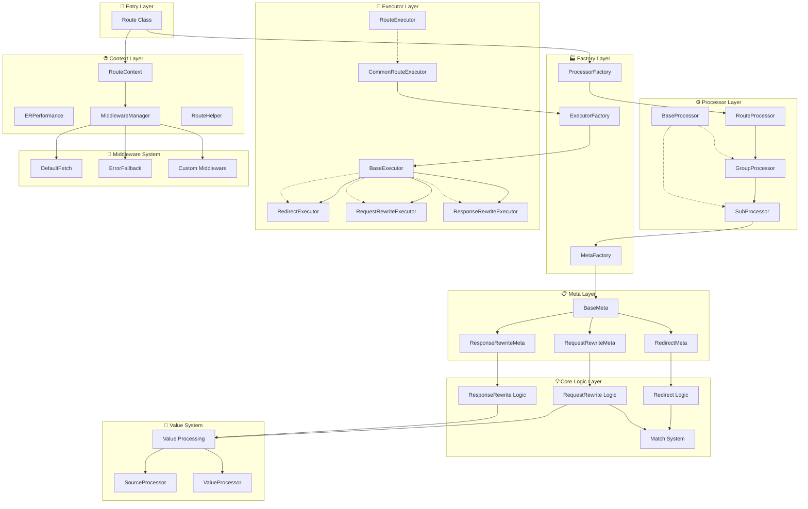
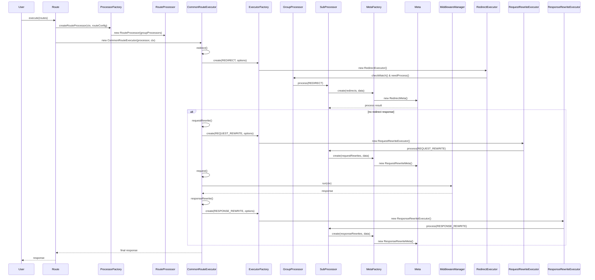

# 🏗️ Unieo 系统架构图

## 整体架构概览



## 执行流程图



## 关键设计模式

### 1. 工厂模式 (Factory Pattern)
- **ProcessorFactory**: 创建和管理 Processor 实例
- **ExecutorFactory**: 创建和管理 Executor 实例  
- **MetaFactory**: 创建和管理 Meta 实例

### 2. 策略模式 (Strategy Pattern)
- **Meta Strategy**: 不同的 Meta 类型(redirects, requestRewrites, responseRewrites)对应不同的处理策略
- **Executor Strategy**: 不同的 Executor 类型对应不同的执行策略

### 3. 责任链模式 (Chain of Responsibility)
- **Processor Chain**: RouteProcessor → GroupProcessor → SubProcessor
- **Executor Chain**: CommonRouteExecutor → SpecificExecutor → Meta → CoreLogic

### 4. 组合模式 (Composite Pattern)
- **Route Configuration**: GroupRoute 包含多个 SubRoute，形成树状结构
- **Match System**: 支持嵌套的匹配条件

## 核心特性

### 🔄 可扩展性
- 通过工厂模式支持动态注册新的 Processor、Executor、Meta 类型
- 支持自定义中间件注册
- 基于接口的设计支持用户扩展

### 🛡️ 类型安全
- 全面的 TypeScript 泛型支持
- 严格的类型检查和推导
- 编译时类型安全保证

### ⚡ 性能优化
- 工厂实例缓存机制
- 延迟初始化
- 内置性能监控 (ERPerformance)

### 🔧 模块化设计
- 清晰的职责分离
- 低耦合高内聚
- 支持独立测试和替换组件

## Meta 层架构详解

```mermaid
graph LR
    subgraph "Meta Configuration"
        RawMeta[Raw Meta Config] 
        RawRedirect[redirects: RawRedirect[]]
        RawRequestRewrite[requestRewrites: RawRequestRewrite[]]
        RawResponseRewrite[responseRewrites: RawResponseRewrite[]]
    end

    subgraph "Meta Factory System"
        MetaFactory[MetaFactory]
        MetaConstructor[MetaConstructor]
        MetaRegistry[Static Meta Registry]
    end

    subgraph "Meta Implementations"
        RedirectMeta[RedirectMeta]
        RequestRewriteMeta[RequestRewriteMeta]
        ResponseRewriteMeta[ResponseRewriteMeta]
    end

    subgraph "Core Logic"
        RedirectLogic[Redirect Logic]
        RequestRewriteLogic[RequestRewrite Logic] 
        ResponseRewriteLogic[ResponseRewrite Logic]
        MatchSystem[Match System]
        ValueSystem[Value System]
    end

    RawMeta --> MetaFactory
    MetaFactory --> MetaConstructor
    MetaConstructor --> RedirectMeta
    MetaConstructor --> RequestRewriteMeta
    MetaConstructor --> ResponseRewriteMeta

    RedirectMeta --> RedirectLogic
    RequestRewriteMeta --> RequestRewriteLogic
    ResponseRewriteMeta --> ResponseRewriteLogic

    RedirectLogic --> MatchSystem
    RequestRewriteLogic --> MatchSystem
    RequestRewriteLogic --> ValueSystem
    ResponseRewriteLogic --> ValueSystem
```

## 价值系统架构

```mermaid
graph TB
    subgraph "Value Configuration"
        ValueRawData[ValueRawData]
        Source[source: unknown]
        SourceType[sourceType: string]
        ValueType[valueType?: ValueType]
    end

    subgraph "Source Processing"
        SourceProcessorManager[SourceProcessorManager]
        LiteralSource[LiteralSourceProcessor]
        RequestHeaderSource[RequestHeaderSourceProcessor]
        ResponseHeaderSource[ResponseHeaderSourceProcessor]
        UrlSource[UrlSourceProcessor]
        CookieSource[CookieSourceProcessor]
        QuerySource[QuerySourceProcessor]
        FetchSource[FetchSourceProcessor]
    end

    subgraph "Value Processing"
        ValueProcessorManager[ValueProcessorManager]
        JsonValue[JsonValueProcessor]
        StringValue[StringValueProcessor]
        NumberValue[NumberValueProcessor]
        BooleanValue[BooleanValueProcessor]
        MatchValue[MatchValueProcessor]
    end

    ValueRawData --> SourceProcessorManager
    SourceProcessorManager --> LiteralSource
    SourceProcessorManager --> RequestHeaderSource
    SourceProcessorManager --> ResponseHeaderSource
    SourceProcessorManager --> UrlSource
    SourceProcessorManager --> CookieSource
    SourceProcessorManager --> QuerySource
    SourceProcessorManager --> FetchSource

    SourceProcessorManager --> ValueProcessorManager
    ValueProcessorManager --> JsonValue
    ValueProcessorManager --> StringValue
    ValueProcessorManager --> NumberValue
    ValueProcessorManager --> BooleanValue
    ValueProcessorManager --> MatchValue
```



此架构图展示了 Unieo 的完整系统设计，突出了其模块化、可扩展和类型安全的特性。